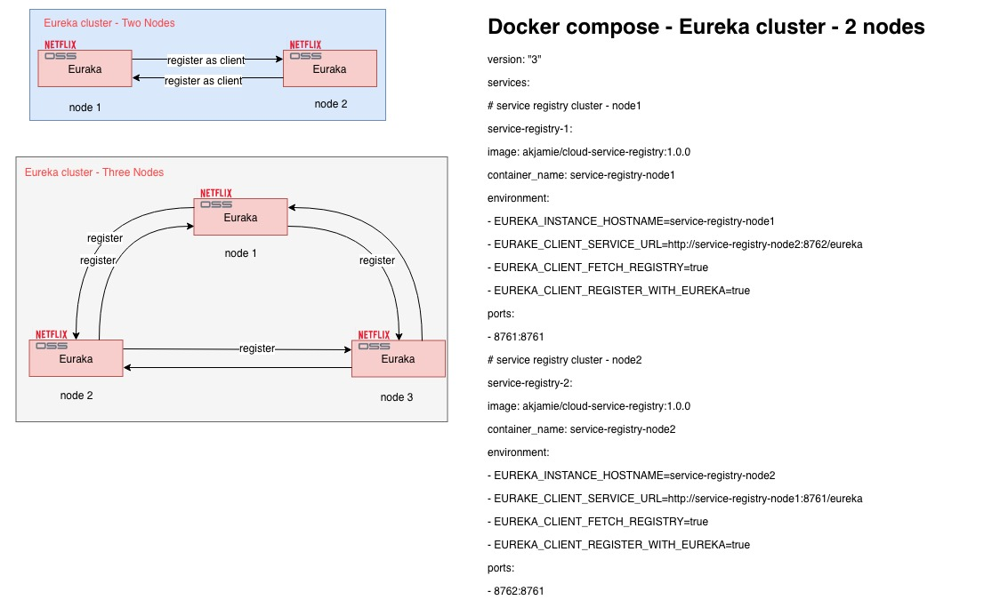

# Service Registry Netflix Eureka + Spring Cloud
- Spring boot application to setup eureka server
  simple and easy to find samples on internet
- Clustering deployment  
  1. Peer Awareness deployment model  
  Eureka can be made even more resilient and available by running multiple instances and asking them to register with each other.
  
  2. A simple deployment architecture diagram
  
  
  3. Deploy the cluster using docker-compose with below content:  
```
#docker-compose
version:"3"
services:
  #service registry cluster - node1
  service-registry-1:
    image: akjamie/cloud-service-registry:1.0.0
    container_name: service-registry-node1
    environment:
      - EUREKA_INSTANCE_HOSTNAME=service-registry-node1
      - EURAKE_CLIENT_SERVICE_URL=http://service-registry-node2:8762/eureka
      - EUREKA_CLIENT_FETCH_REGISTRY=true
      - EUREKA_CLIENT_REGISTER_WITH_EUREKA=true
    ports:
      - 8761:8761
  #service registry cluster - node2
  service-registry-2:
    image: akjamie/cloud-service-registry:1.0.0
    container_name: service-registry-node2
    environment:
      - EUREKA_INSTANCE_HOSTNAME=service-registry-node2
      - EURAKE_CLIENT_SERVICE_URL=http://service-registry-node1:8761/eureka
      - EUREKA_CLIENT_FETCH_REGISTRY=true
      - EUREKA_CLIENT_REGISTER_WITH_EUREKA=true
    ports:
      - 8762:8761
 ```
>this is different from the Standalone Mode, each eureka node should register to other nodes to be a peer
 
 
 
